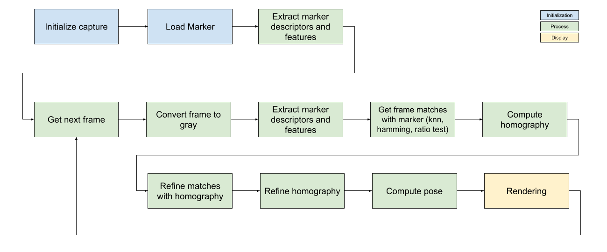

# AR basics

## Abstract

This project aimed to learn the basics of pose estimation for augmented reality. It relies on OpenCV library to process frame and computes pose estimation.

*[Youtube demo (ORB)](https://youtu.be/HUaX9xxEagU)*

*Natural marker*

## Packages
*Using Python 3.8.0*

[OpenCV (4.4.0)](https://anaconda.org/conda-forge/opencv)
`conda install -c conda-forge opencv`

## Scripts
### Description
* [main.py](./main.py), Main script to process pose estimation and display 3D object. You can override default parameters with the following argurments.

    * `-s, --source` : Capture device index or video filepath
    * `-x` : Witdh of the image source
    * `-y` : Height of the image source
    * `-c , --calibration` : Path to the camera calibration file
    * `-m, --marker` : Path to image marker
    * `-o, --object` : 3D Object to display (.obj)
    * `-min, --minMatches` : Min matches
    * `-max, --maxMatches` : Max matches
    * `--all` : Show any step of the pipeline
    * `--unmove` : Don't move position of windows as start
    * `--detector` : Choose detector [ORB, SIFT, AKAZE] by default AKAZE
    * `--matcher` : Choose matcher [HAMMING, L2,FLANN] by default HAMMING
    * `--log` : Choose logging level [DEBUG, INFO, WARNING, ERROR, CRITICAL]

* [CameraOpenCV.py](./CameraOpenCV.py), script use to manage OpenCV camera object

### Run 
`python main.py --source 0 --all --detector=ORB --matcher=HAMMING --log=INFO`